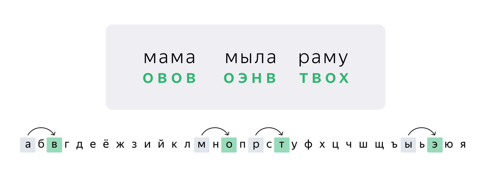

 # Задача 1

В биологической лаборатории выводят премиальную породу очень полезных бактерий. Отдельные колонии бактерий выращивают в автоматизированных чашках Петри.

 Но бактерии вырвались на свободу и устроили короткое замыкание. Система управления сгорела, программа была уничтожена. Спасать ситуацию выпало именно вам: надо восстановить программу.

## Как должна работать программа

При создании новой колонии в программе создаётся объект класса `BacteriaProducer` и устанавливается предельная численность популяции: в инициализатор класса передаётся параметр `max_bacteria`. 

Текущее количество бактерий в колонии хранится в атрибуте объекта `current_bacteria_count`.

Помимо инициализатора у экземпляров класса `BacteriaProducer` есть два метода:
* при вызове метода `delete()` должна удаляться одна бактерия из популяции: счётчик `current_bacteria_count` должен уменьшиться на 1;
* при вызове метода `create()` в популяцию должна добавляться одна бактерия: счётчик `current_bacteria_count` должен увеличиться на 1;

Значение счётчика `current_bacteria_count` не должно превышать значение `max_bacteria` и не должно быть меньше 0. 

1. В инициализаторе класса опишите два атрибута:
    * атрибут `max_bacteria` должен быть равен значению аргумента `max_bacteria`, переданного в инициализатор класса при создании объекта;
    * атрибут `current_bacteria_count` должен хранить количество бактерий в каждый текущий момент времени. По умолчанию этот атрибут должен быть равен 0.
2. Опишите метод create(), который отвечает за добавление бактерии в колонию. 

    При вызове этого метода счётчик бактерий current_bacteria_count должен увеличиться на единицу.

     Если в момент вызова этого метода количество бактерий в популяции `current_bacteria_count` равно максимально возможному количеству бактерий в колонии `max_bacteria` — новую бактерию не следует добавлять; программа должна напечатать сообщение об ошибке:
    ```
     Нет места под новую бактерию
    ```
    В ином случае увеличьте счётчик бактерий на единицу и напечатайте сообщение:
    ```
     Добавлена одна бактерия. Бактерий в колонии: <число>
    ```
3. Опишите метод `delete()`, который при каждом вызове удаляет из колонии по одной бактерии.     
Если в момент вызова этого метода количество бактерий в популяции `current_bacteria_count` равно нулю — бактерию удалить невозможно. Программа должна напечатать сообщение об ошибке:
```
 В популяции нет бактерий, удалять нечего
 
```
В ином случае уменьшите счётчик бактерий на единицу и напечатайте сообщение:
```
 Одна бактерия удалена. Бактерий в колонии: <число>
 ```
# Задача 2 


Стас Басов начал писать приложение для грибников, но наступила зима — и ему стало не до грибов. Вам предстоит закончить работу над приложением.

Идея приложения такова: создаётся программная «корзина для грибов» (объект класса `MushroomsCollector`), и каждый найденный в лесу гриб добавляется в эту корзину (учитывается в программе). Если гриб несъедобен — программа должна запретить добавление этого гриба в корзину.

Может быть создано несколько таких «программных корзин».

В прекоде есть класс `MushroomsCollector`, он отвечает за проверку и сохранение грибов. Допишите этот класс и исправьте ошибки.
* Список `mushrooms `ведёт себя странно и неправильно: если в программе создано несколько корзин — в этом списке оказываются все грибы из всех корзин. Исправьте код так, чтобы каждая корзина хранила собственный список грибов.
* Метод `is_poisonous()` должен принять на вход название гриба и проверить, не ядовит ли гриб. Сейчас этот метод работает с ошибкой и признаёт все грибы ядовитыми. Исправьте этот метод так, чтобы он нормально выполнял свою задачу.
* Метод `add_mushroom()` должен принять на вход название гриба и, если гриб не ядовит (если метод `is_poisonous()` вернул `False`), сохранить его в список mushrooms.
Если же метод `is_poisonous()` вернул `True` — программа должна напечатать сообщение об ошибке:
```
Нельзя добавить ядовитый гриб
```
* Реализуйте магический метод `__str__`, который выводит через запятую и пробел элементы списка mushrooms конкретного объекта класса `MushroomsCollector`. Например:
```
  белый, рыжик, груздь, лисичка
  
```

# Задача 3


Студенты, наставники и ревьюеры Практикума в общем чате перебрасываются мемами, анекдотами и шутками. Студенты решили шифровать анекдоты и шутки про ревьюеров и наставников, а не публиковать их в открытом виде: как бы чего не вышло.

Ваша задача — написать шифрующий/дешифрующий класс `CipherMaster` с методами `cipher()` (англ. «шифровать») и `decipher()` (англ. «расшифровать»).

Для шифрования строки студент 
* создаёт объект класса `CipherMaster`,
* вызывает у этого объекта метод `cipher()` и передаёт в него строку, которую надо зашифровать;
* метод возвращает строку в зашифрованном виде.

Аналогично работает и дешифровка, только надо вызывать метод `decipher()` и передать в него зашифрованную строку.

Шифрование и дешифровку нужно выполнять по «методу Цезаря»: любая буква в тексте заменяется на другую — со сдвигом по алфавиту вперёд или назад на определённое количество символов.

Например, при шифровании по методу Цезаря со сдвигом на 2 буквы вправо выражение «мама мыла раму» превратится в заклинание «овов оэнв твох»: __м__ превратится в __о__, которая стоит на две позиции правее, то же произойдёт и с остальными буквами.


При шифровании алфавит «зацикливается», и, например, при сдвиге 2 буква __я__ должна быть заменена на __б__.

Требования к классу `CipherMaster`:

Текст, переданный для шифрования, может содержать буквы в любом регистре.

Метод `cipher()` должен принимать исходную строку и целое число, означающее сдвиг по алфавиту. Этот метод должен возвращать зашифрованную строку.

Метод `decipher()` должен принимать зашифрованную строку и целое число, означающее сдвиг по алфавиту. Этот метод должен возвращать расшифрованную строку.

Текст, возвращаемый методами `cipher()` и `decipher()`, должен быть приведён к нижнему регистру (не должен содержать больших букв)

Любые символы, не входящие в строку `alphabet`, не должны заменяться.